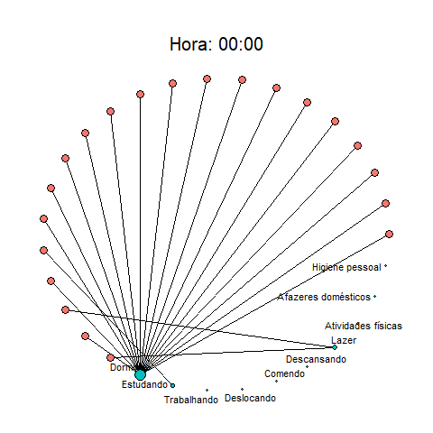

# Introdução

## Olá! Eu sou o Amilcar!

Finalizei o curso de visualização de dados da curso-R e montei esta apresentação como parte do trabalho final.

Ao invés de utilizar a base de dados proposta pelo curso, optei por coletar dados sobre o dia-a-dia de alguns de meus amigos, por trazer um tom talvez um pouco mais cômico ao contexto.

--

## Sobre o projeto

Inicialmente, acreditei que conseguiria replicar o gráfico ["A Day in the Life of Americans"](https://flowingdata.com/2015/12/15/a-day-in-the-life-of-americans/), mas depois de duas semanas de pesquisas intensas, acabei desistindo para conseguir pelo menos apresentar algum tipo de gráfico neste trabalho e concorrer à bolsa proposta.

Sendo assim, a apresentação descreverá um pouco do dia-a-dia de um amigo médio do Amilcar (também conhecidos como meus amigos), e concluirá com o mais próximo que eu consegui chegar do gráfico que me motivou.
---
# Metodologia

## Coleta
Foi criada uma [planilha do google sheets](https://docs.google.com/spreadsheets/d/1Dx9Za-b1hqeiKso1E067M1BgF6VhdbGyz9FZJC662Sk/edit#gid=2051768494), onde as atividades foram previamente selecionadas por mim, para evitar a necessidade de um trabalho extensivo de limpeza de dados.

Ciente do quão intrometido eu já estava sendo ao pedir para meus amigos que me informassem o que faziam a cada parte do seu dia, optei por manter o intervalo de 15 minutos entre uma atividade e outra, por acreditar que já seria o suficiente para alcançar meu objetivo.

--

## Análise

Uma vez com os dados na mão, me debrucei sobre o desafio de recriar o gráfico mencionado anteriormente e após falhar miseravelmente percebi que precisava fazer algo mais para entregar como trabalho final. Sendo assim, para manter as amizades e evitar irritá-las mais ainda pedindo para preencher outra planilha ou formulário, optei por tentar extrair o máximo de informações possíveis do que já havia coletado.

---
class: inverse, center, middle

# Uma análise geral...

---

# O tempo gasto em cada atividade

COLOCAR UM BOXPLOT SEPARADO POR ATIVIDADE

---

# O tempo gasto em cada atividade

COLOCAR GRÁFICO DE BARRAS COM A SOMA DOS TEMPOS E UM ÍCONE REPRESENTADO CADA UM

---

class: inverse, center, middle

# Analisando o sono dos amigos

---

# Quanto eles dormem?

INSERIR INFORMAÇÕES:

* Média de tempo;
* Média de hora de ir dormir;
* Média de hora de acordar

---

# Mais horas de sono implicam em algo?

RODAR REGRESSÕES PARA ENCONTRAR ALGUMA VARIÁVEL RELEVANTE

---

# Mais horas de sono implicam em algo?

PLOTAR GRÁFICO DE DISPERSÃO COM RETA DE TENDÊNCIA, FACETS PARA ATIVIDADES

---

class: inverse, center, middle

# E afinal... Como é o dia deles?

---
# Uma análise breve de migração...

PLOTAR SANKEY SEPARADO DE 6 EM 6 HORAS, COM AS ATIVIDADES MAIS COMUNS

---

class: inverse, center, middle

# E agora...

---
class: inverse, center, middle

# O tão esperado momento...

---
class: inverse, center, middle

# Finalmente

---
class: inverse, center, middle

# Chegou!

---

class: inverse, center, middle

## Acompanhe a seguir como se comporta um amigo médio do Amilcar em seu dia...

---

# Mentira!

Antes precisamos explicar o gráfico...

--

* A hora na parte de cima representa a hora do dia

--

* Cada ponto vermelho representa um amigo do Amilcar

--

* Cada ponto azul representa uma atividade que o amigo do Amilcar pode ou não estar fazendo
  * No momento da hora apresentada no título

--

* Se o amigo estiver realizando a atividade, haverá uma ligação entre ele e a atividade

--

* Para facilitar a visualização de qual atividade está com mais pessoas naquele determinado horário, o tamanho da bolinha que representa a atividade é influenciado pela quantidade de ligações que possuem.

---
class: inverse, center, middle

# Agora sim!

---
class: clear, center

```{r echo=FALSE}

```

---

class: inverse, center, middle

# Muito obrigado!

Slides criados com o pacote [*xaringan*](https://github.com/yihui/xaringan).